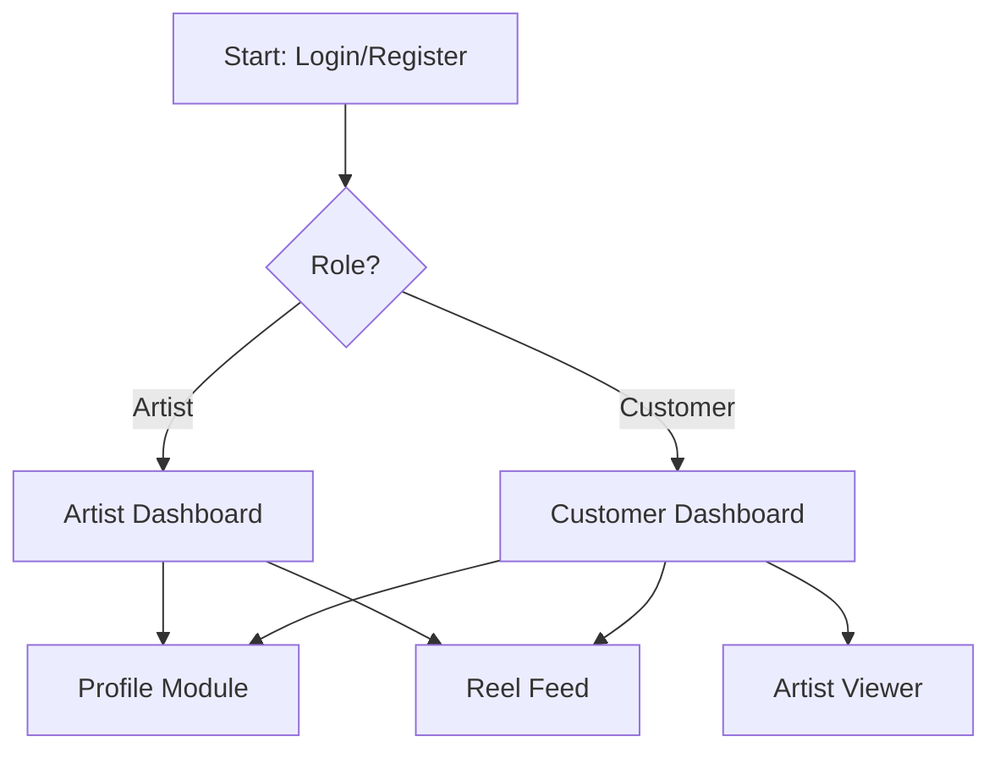

# 🎨 ArtistSphere Desktop System

This is a multi-component C++ desktop application suite built with **Qt** and **CMake**. It includes systems for managing artists, customer interactions, login/register flows, profile management, and reel feed display — designed for a multimedia service or artist platform.

---

## 📦 Modules Overview

| Module             | Executable       | Description                             |
| ------------------ | ---------------- | --------------------------------------- |
| **Artist App**     | `artist.exe`     | GUI for artists to manage their content |
| **Artist Viewer**  | `artist.exe`     | View-only interface for artist profiles |
| **Customer App**   | `customer.exe`   | Interface for customers to explore/buy  |
| **Login/Register** | `LoginApp.exe`   | Handles authentication                  |
| **Profile Viewer** | `ProfileApp.exe` | Shows user profile details              |
| **Reel Feed**      | `reel_feed.exe`  | Displays content in a reel-like format  |

---

## 🧰 Tech Stack

* **C++**
* **Qt Framework**
* **CMake**
* **VS Code** (or Qt Creator)

---

## 🏗️ Building the Project

Make sure you have the following installed:

* Qt (with QtWidgets)
* CMake
* GCC/Clang or MSVC

### 🧱 General Build Steps for Any Module:

```bash
cd <module_name>
mkdir build
cd build
cmake ..
make
```

> Example:
>
> ```
> cd artist
> mkdir build && cd build
> cmake ..
> make
> ./artist
> ```

---

## 🚀 Running Executables

### 🔹 Artist Module

```bash
cd artist/build
./artist
```

### 🔹 Artist Viewer

```bash
cd artist_viewer/build
./artist
```

### 🔹 Customer Module

```bash
cd customer/build
./customer
```

### 🔹 Login/Register

```bash
cd login_register/build
./LoginApp
```

### 🔹 Profile Module

```bash
cd profile/build
./ProfileApp
```

### 🔹 Reel Feed

```bash
cd reel/build
./reel_feed
```

---

## 📁 Folder Structure

```
webtech/
├── artist/               # Artist module
├── artist_viewer/        # Viewer for artist profiles
├── customer/             # Customer-side application
├── login_register/       # Authentication system
├── profile/              # Profile management
├── reel/                 # Reel feed display system
├── session.json / .txt   # Session data
├── .vscode/              # IDE config
```

---

## 💡 Tips

* Run Qt setup and ensure environment variables (`qmake`, etc.) are accessible.
* Each module is self-contained and can be built independently.
* The `build/` folders may already contain Windows `.exe` files if cloned from a Windows system.

---

## 🔒 License

MIT License (or specify if different)

---

## 🙋‍♂️ Contribution

If you want to contribute or fork this project, feel free to open issues or pull requests.

---

## 🧭 Application Process Flow (System Workflow)

This section explains how the modules interact and guide users through the system.

---

### 🔐 1. Login & Register Module

* **Executable**: `LoginApp.exe`
* **Purpose**: Acts as the first entry point for both customers and artists.
* **Features**:

  * Register a new account
  * Login with existing credentials
  * User role (artist or customer) is detected after login

➡️ **Post-login routing**:

* If the user is an **Artist** → redirect to **Artist App**
* If the user is a **Customer** → redirect to **Customer App**

---

### 👤 2. Profile Module

* **Executable**: `ProfileApp.exe`
* **Purpose**: View and edit the user's personal or artist profile
* **Features**:

  * Update name, contact, and other details
  * Artist can add portfolio information
  * Customers can view their past activity

---

### 🎨 3. Artist Module

* **Executable**: `artist.exe`
* **Purpose**: Main workspace for artists
* **Features**:

  * Upload or manage artwork/media
  * View customer interactions
  * Use Trie-based fast search for content in real time 

---

### 👁️ 4. Artist Viewer Module

* **Executable**: `artist.exe` (in `artist_viewer/`)
* **Purpose**: Allows customers to view artist profiles and portfolios
* **Features**:

  * View artist list
  * Explore artist works
  * Possibly request services or communicate

---

### 🧑‍💼 5. Customer Module

* **Executable**: `customer.exe`
* **Purpose**: Customer-side dashboard
* **Features**:

  * Search for artists
  * Interact or book services
  * Track history or purchases

---

### 📺 6. Reel Feed Module

* **Executable**: `reel_feed.exe`
* **Purpose**: Display reel-style content feed
* **Features**:

  * Scrollable or autoplay video/photo reels
  * Likely connected to artist uploads
  * Customer interaction via likes/views

---

## 🔄 System Flow Summary



---

## 📌 What's Next (Planned Features)

Here are the next potential enhancements to make the system more powerful and production-ready:

* 💳 **Payment System**

  * Add module for secure artist-customer payments.
  * Support transaction history, earnings, and refunds.

* 👥 **Follow/Subscription System**

  * Allow customers to follow favorite artists.
  * Notify when artists upload new content.

* 🤖 **AI-Based Suggestions**

  * Recommend artists to customers based on preferences.
  * Recommend trending or similar artworks.

* 📨 **Messaging System**

  * Enable in-app messaging between artists and customers.

* 📅 **Booking & Scheduling System**

  * Customers can book artists for commissions, events, or meetings.


* 🧪 **Testing & QA Suite**

  * Unit tests and UI tests to ensure smooth functionality.


---
